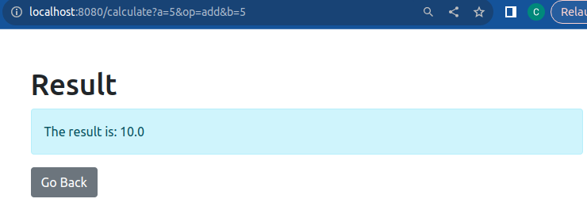

#### Simple calculator with Java, html, Spring Boot

Spring Boot Understanding Assignment given by Safwan Kher(https://github.com/safwan-kher).
Html source example given by him.

---

#### How it appears and works on localhost:8080

